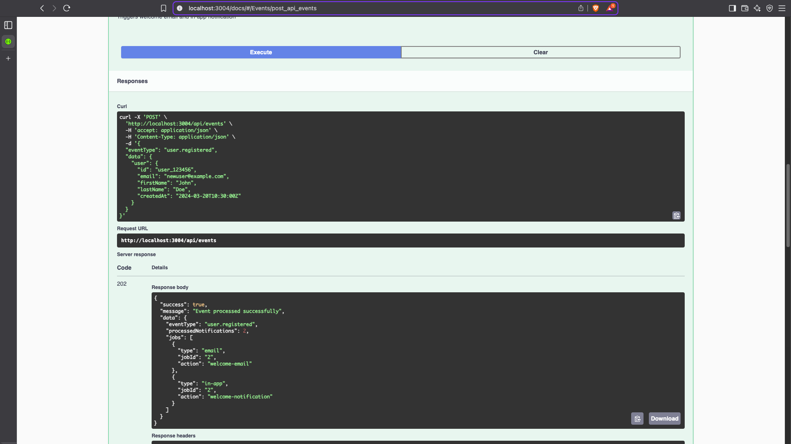
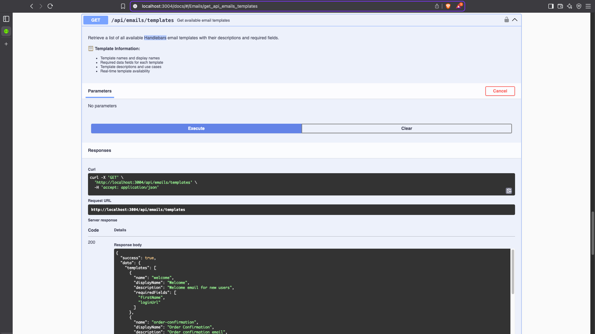

# 🚀 E-commerce Microservices Platform

> Enterprise-grade microservices architecture with event-driven notifications system


## 📋 Table of Contents

- [🏗️ Architecture Overview](#️-architecture-overview)
- [🔔 System in Action](#-system-in-action)
- [✨ Features](#-features)
- [🛠️ Tech Stack](#️-tech-stack)
- [🚀 Quick Start](#-quick-start)
- [📡 API Documentation](#-api-documentation)
- [🧪 Testing the System](#-testing-the-system)
- [🔧 Development](#-development)

## 🏗️ Architecture Overview

```
┌─────────────────┐    ┌─────────────────┐    ┌─────────────────┐
│   Client/App    │────│   API Gateway   │────│  Load Balancer  │
│   (Frontend)    │    │   (Port 3000)   │    │   (Future)      │
└─────────────────┘    └─────────────────┘    └─────────────────┘
                              │
                    ┌─────────┴─────────┐
                    │                   │
        ┌───────────▼─────────┐ ┌───────▼──────────┐
        │  Authentication     │ │   Notification   │
        │   Service (3001)    │ │   Service (3004) │
        └───────────┬─────────┘ └──────────────────┘
                    │                   │
        ┌───────────▼─────────┐ ┌───────▼──────────┐
        │   Product Service   │ │   Order Service  │
        │     (Port 3002)     │ │   (Port 3003)    │
        └─────────────────────┘ └──────────────────┘
                    │                   │
        ┌───────────▼─────────┐ ┌───────▼──────────┐
        │   PostgreSQL DB     │ │   Redis Cache    │
        │     (Port 5432)     │ │   (Port 6379)    │
        └─────────────────────┘ └──────────────────┘
```

### 🔄 Event-Driven Flow

```
User Registration → Auth Service → Event → Notification Service → Welcome Email + In-App
Order Creation   → Order Service → Event → Notification Service → Confirmation Email + In-App
Status Updates   → Order Service → Event → Notification Service → Update Notifications
```

## 🔧 Development

### Project Structure

```
ecommerce-microservices/
├── services/
│   ├── api-gateway/           # API Gateway (Port 3000)
│   ├── auth-service/          # Authentication (Port 3001)
│   ├── product-service/       # Product Management (Port 3002)
│   ├── order-service/         # Order Processing (Port 3003)
│   └── notification-service/  # Notifications (Port 3004)
├── docker-compose.yml         # Service orchestration
├── docs/
│   └── screenshots/           # API documentation screenshots
└── README.md
```

<details>
<summary>🛠️ <strong>Local Development Setup</strong> (Click to expand)</summary>

```bash
# Install dependencies for a specific service
cd services/auth-service
pnpm install

# Run service in development mode
pnpm run dev

# Run database migrations (for services using Prisma)
pnpm run db:migrate
```

</details>

<details>
<summary>⚙️ <strong>Environment Variables</strong> (Click to expand)</summary>

Each service uses the following pattern:

- `NODE_ENV` - Environment (development/production)
- `PORT` - Service port (3000 internal)
- `DATABASE_URL` - PostgreSQL connection
- `REDIS_URL` - Redis connection
- `JWT_SECRET` - Authentication secret

</details>

## 🔔 System in Action

<details>
<summary>🎯 <strong>Event-Driven Architecture Demo</strong> (Click to expand)</summary>


_One event automatically triggers multiple notification channels_

</details>

<details>
<summary>📊 <strong>Complete API Documentation</strong> (Click to expand)</summary>


_Professional Swagger documentation with comprehensive endpoint coverage_

</details>

<details>
<summary>🔄 <strong>Event Processing Endpoint</strong> (Click to expand)</summary>


_Advanced event-driven architecture documentation_

</details>

<details>
<summary>📧 <strong>Template System Integration</strong> (Click to expand)</summary>


_Handlebars template engine with dynamic content_

</details>

### 📊 Interactive API Documentation

- **Auth Service**: `http://localhost:3001/docs` - JWT authentication & user management
- **Order Service**: `http://localhost:3003/docs` - Order processing & tracking
- **Notification Service**: `http://localhost:3004/docs` - **Event-driven notifications with queues**
- **Product Service**: `http://localhost:3002/docs` - Product catalog & search

**🎯 Featured**: Notification Service Swagger shows advanced event-driven architecture with Bull queues, Redis, and Handlebars templates.

## ✨ Features (Services)

<details>
<summary>🔐 <strong>Authentication & Authorization</strong> (Click to expand)</summary>

- **JWT-based authentication** with refresh tokens
- **Role-based access control** (USER/ADMIN)
- **Secure password hashing** with bcrypt
- **Token validation middleware**

</details>

<details>
<summary>🛒 <strong>E-commerce Core</strong> (Click to expand)</summary>

- **Product catalog** with categories and search
- **Shopping cart management**
- **Order processing** with inventory validation
- **Order status tracking** (PENDING → CONFIRMED → SHIPPED → DELIVERED)

</details>

<details>
<summary>🔔 <strong>Smart Notifications</strong> (Click to expand)</summary>

- **Event-driven notifications** system
- **Email templates** with Handlebars
- **In-app notifications** with Redis storage
- **Queue-based processing** with retry logic
- **Multiple notification channels** (Email + In-App)

</details>

<details>
<summary>🏗️ <strong>Architecture Patterns</strong> (Click to expand)</summary>

- **API Gateway** pattern for unified entry point
- **Microservices** architecture with Docker
- **Event-driven communication** between services
- **CQRS** for read/write separation
- **Circuit breaker** pattern (implemented in gateway)

</details>

## 🛠️ Tech Stack

<details>
<summary>🔧 <strong>Backend Services</strong> (Click to expand)</summary>

- **Node.js 22** - Runtime environment
- **Express.js** - Web application framework
- **Prisma** - Database ORM and migration tool
- **Zod** - Runtime type validation

</details>

<details>
<summary>💾 <strong>Databases & Cache</strong> (Click to expand)</summary>

- **PostgreSQL 15** - Primary database for persistent data
- **Redis 7** - Cache and session storage + Queue management

</details>

<details>
<summary>🔔 <strong>Notification System</strong> (Click to expand)</summary>

- **Bull** - Job queue processing
- **Nodemailer** - Email service integration
- **Handlebars** - Email template engine

</details>

<details>
<summary>🔐 <strong>Security & Validation</strong> (Click to expand)</summary>

- **JWT** - JSON Web Tokens for authentication
- **bcryptjs** - Password hashing
- **Helmet** - Security headers
- **express-rate-limit** - Request rate limiting
- **CORS** - Cross-origin resource sharing

</details>

<details>
<summary>🚀 <strong>Development & Deployment</strong> (Click to expand)</summary>

- **Docker & Docker Compose** - Containerization
- **pnpm** - Package management
- **Winston** - Logging framework
- **Nodemon** - Development server

</details>

## 🚀 Quick Start

### Prerequisites

- **Docker** and **Docker Compose**
- **Node.js 18+** (for local development)
- **pnpm** (recommended) or npm

### 1. Clone the Repository

```bash
git clone https://github.com/Alex-TheResilient/ecommerce-microservices.git
cd ecommerce-microservices
```

### 2. Start the Platform

```bash
# Build and start all services
docker-compose up --build

# Or run in background
docker-compose up -d --build
```

### 3. Verify Installation

```bash
# Check all services are running
docker ps

# Test API Gateway
curl http://localhost:3000/health

# Test individual services
curl http://localhost:3001/health  # Auth Service
curl http://localhost:3002/health  # Product Service
curl http://localhost:3003/health  # Order Service
curl http://localhost:3004/health  # Notification Service
```

### 4. Health Monitoring

```bash
# Overall system health
curl http://localhost:3000/health

# Individual service health
curl http://localhost:3000/health/services

# Notification service queue stats
curl http://localhost:3004/health/detailed
```

## 📡 API Documentation

### 🔗 Base URLs

- **API Gateway**: `http://localhost:3000` (Production entry point)
- **Auth Service**: `http://localhost:3001` (Direct access)
- **Product Service**: `http://localhost:3002` (Direct access)
- **Order Service**: `http://localhost:3003` (Direct access)
- **Notification Service**: `http://localhost:3004` (Direct access)

### 🔐 Authentication Example

```bash
# Register a new user
curl -X POST http://localhost:3000/api/auth/register \
  -H "Content-Type: application/json" \
  -d '{
    "email": "user@example.com",
    "firstName": "John",
    "lastName": "Doe",
    "password": "securepassword"
  }'

# Login
curl -X POST http://localhost:3000/api/auth/login \
  -H "Content-Type: application/json" \
  -d '{
    "email": "user@example.com",
    "password": "securepassword"
  }'
```

### 🔔 Event-Driven Notifications Example

```bash
# Process an event (triggers multiple notifications)
curl -X POST http://localhost:3000/api/events \
  -H "Content-Type: application/json" \
  -H "Authorization: Bearer YOUR_JWT_TOKEN" \
  -d '{
    "eventType": "user.registered",
    "data": {
      "user": {"id": "123", "email": "user@example.com", "firstName": "John"}
    }
  }'

# Result: Automatically creates 2 jobs
# → Email Job: Welcome email with template
# → In-App Job: Welcome notification in Redis
```

## 🧪 Testing the System

### End-to-End User Flow

```bash
# 1. Register a new user (triggers welcome email + in-app notification)
curl -X POST http://localhost:3000/api/auth/register \
  -H "Content-Type: application/json" \
  -d '{
    "email": "test@example.com",
    "firstName": "Test",
    "lastName": "User",
    "password": "password123"
  }'

# 2. Login to get authentication token
TOKEN=$(curl -X POST http://localhost:3000/api/auth/login \
  -H "Content-Type: application/json" \
  -d '{
    "email": "test@example.com",
    "password": "password123"
  }' | jq -r '.data.token')

# 3. Create an order (triggers confirmation email + in-app notification)
curl -X POST http://localhost:3000/api/orders \
  -H "Content-Type: application/json" \
  -H "Authorization: Bearer $TOKEN" \
  -d '{
    "items": [
      {
        "productId": "1",
        "quantity": 1
      }
    ]
  }'
```

## 📄 License

This project is licensed under the MIT License - see the [LICENSE](LICENSE) file for details.

---

**⭐ Star this repository if you found it helpful!**
